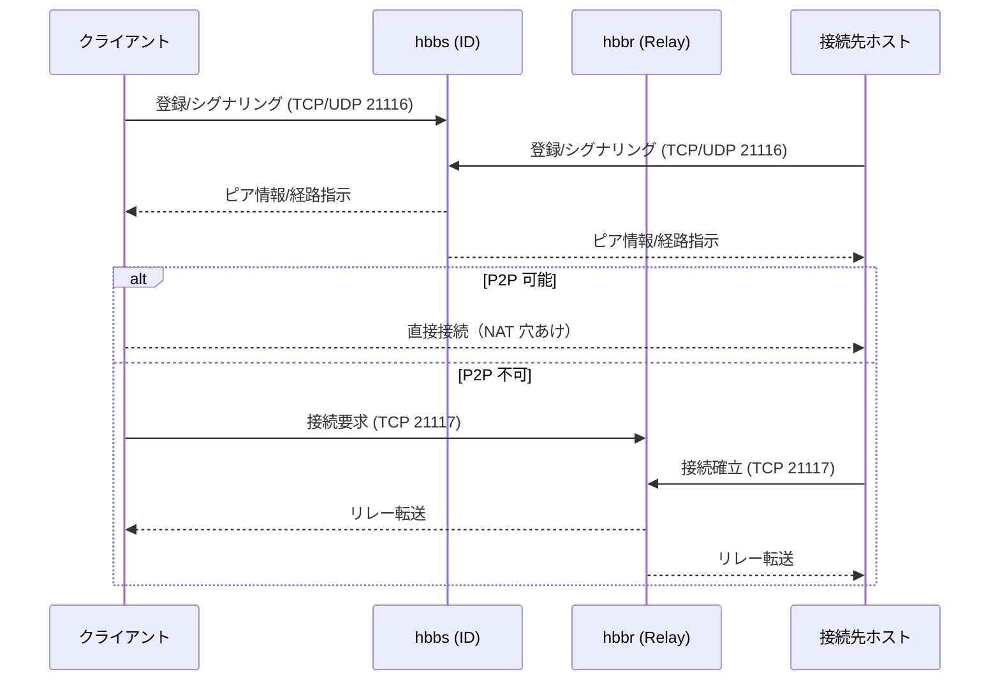
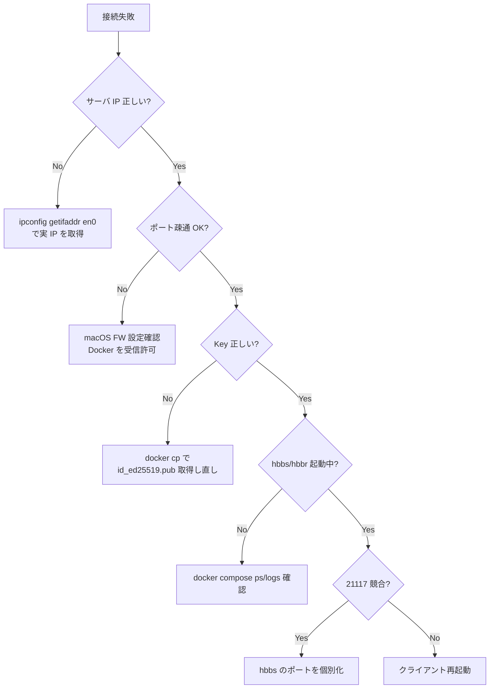

## はじめに

RustDeskのhbbs/hbbrをDocker Composeで常駐させ、同一LAN内からクライアントで接続するための手順をまとめました。

RustDeskはTeamViewerやAnyDeskのようなリモートデスクトップツールですが、自前でサーバを立てることで外部サービスに依存せずに利用できます。

:::note
筆者はWindowsにサーバを立てて、Mac、WindowsにRustDeskを導入し、どこからでも接続できるようにしています。
:::

## アーキテクチャ

### 役割とポート

| サーバ | 役割 | ポート |
|--------|------|--------|
| **hbbs** | ID / rendezvous server | TCP 21115（ID登録）, TCP/UDP 21116（シグナリング/NATテスト）, TCP 21114/21118（付随機能） |
| **hbbr** | relay server | TCP 21117（中継） |

### 構成図

```
┌─────────────────────────────────────────────────┐
│              LAN (192.168.x.0/24)               │
│                                                 │
│  ┌─────────────┐      ┌─────────────────────┐  │
│  │   Windows   │      │   Mac (Server)      │  │
│  │   Client    │◄────►│   Docker Desktop    │  │
│  └─────────────┘      │   ├─ hbbs           │  │
│                       │   └─ hbbr           │  │
│  ┌─────────────┐      └─────────────────────┘  │
│  │  Mac/Linux  │               ▲               │
│  │   Client    │───────────────┘               │
│  └─────────────┘                               │
└─────────────────────────────────────────────────┘
```

### 鍵管理

hbbs初回起動時に `id_ed25519.pub`（公開鍵）が生成されます。クライアントのNetwork設定にこの鍵を貼り付けて認証します。

## 前提条件

- サーバ用PCにDockerがインストール済み
- サーバのLAN IPを把握している
- ファイアウォールで以下ポートの通過を許可
  - 21115/TCP
  - 21116/TCP & UDP
  - 21117/TCP
- クライアントにRustDeskがインストール済み

## Docker Compose 設定

### ファイル作成

```bash
mkdir -p ~/rustdesk-server
cd ~/rustdesk-server
```

`docker-compose.yml`を以下の内容で作成します。

:::note warn
Compose v2では`version`フィールドは省略推奨（警告回避）
:::

```yaml
services:
  hbbs:
    image: rustdesk/rustdesk-server
    container_name: rustdesk-hbbs
    restart: unless-stopped
    volumes:
      - rustdesk-data:/root
    ports:
      - "21114:21114"
      - "21115:21115"
      - "21116:21116"
      - "21116:21116/udp"
    command: hbbs

  hbbr:
    image: rustdesk/rustdesk-server
    container_name: rustdesk-hbbr
    restart: unless-stopped
    volumes:
      - rustdesk-data:/root
    ports:
      - "21117:21117"
    command: hbbr

volumes:
  rustdesk-data:
```

## サーバセットアップ手順

### 1. 起動と状態確認

```bash
docker compose up -d
docker compose ps
```

ログ確認:

```bash
docker logs rustdesk-hbbs --tail 50
docker logs rustdesk-hbbr --tail 50
```

### 2. 公開鍵（Key）の取得

```bash
docker cp rustdesk-hbbs:/root/id_ed25519.pub ./id_ed25519.pub
cat ./id_ed25519.pub
```

:::note alert
表示された1行をクライアント設定のKeyに貼り付けます。**改行・空白を混入させないこと。**
:::

### 3. サーバのLAN IP確認

```bash
ipconfig getifaddr en0
```

Wi-Fi/有線でインターフェイスが異なる場合は`en1`などに読み替えてください。

## クライアントインストール

### Mac

```bash
brew install --cask rustdesk
```

### Windows

```powershell
winget install rustdesk.rustdesk
```

または[公式サイト](https://rustdesk.com/)からインストーラをダウンロード。

## クライアント設定

RustDeskを起動し、**Settings > Network > Unlock** から以下を設定します。

| 項目 | 設定値 |
|------|--------|
| **ID Server** | サーバのLAN IP（例: `192.168.1.100`）※ポート指定不要 |
| **Relay Server** | 同上 |
| **Key** | `id_ed25519.pub`の内容（公開鍵全文、1行） |

### 無人アクセス設定（推奨）

接続される側で **Settings > Security > Unattended Access** を有効化し、強固なパスワードを設定しておくと、承諾操作なしで接続できます。

## 接続確認

### Windows からの疎通確認

```powershell
Test-NetConnection <サーバIP> -Port 21116   # hbbs
Test-NetConnection <サーバIP> -Port 21117   # hbbr
```

### 接続フロー

1. 接続される側のRustDeskを起動しIDを表示
2. 接続する側のRustDeskで相手のIDを入力して接続
3. 初回は接続される側で「承諾」、または無人アクセスのパスワードで入室

## 接続シーケンス



## トラブルシューティング

### 1. `port is already allocated` エラー

**原因:** 既にポートが他プロセス/コンテナにより占有されている

**対処:**

```bash
docker ps -a
docker rm -f rustdesk-hbbr rustdesk-hbbs
# 占有プロセスを確認
lsof -i :21117
```

:::note info
hbbsで21114-21119を一括公開するとhbbrの21117と競合するため、ポートは個別に公開してください。
:::

### 2. コンテナ内で鍵が読めない

**症状:** `cat` コマンドが見つからない

**対処:** `docker cp` を使用

```bash
docker cp rustdesk-hbbs:/root/id_ed25519.pub ./id_ed25519.pub
```

### 3. `Failed to connect to <IP>:21116` エラー

**原因:** 指定したIPが間違っている（ゲートウェイIPなど）

**対処:**

```bash
# 実際のサーバ IP を確認
ipconfig getifaddr en0
```

### 4. Test-NetConnectionが失敗

**原因:** macOSファイアウォールがDockerの受信をブロック

**対処:**
システム設定 > ネットワーク > ファイアウォール > オプション で `Docker Desktop` / `com.docker.backend` を受信許可に設定

### 5. 疎通は通るがRustDesk接続失敗

**原因:** Keyの貼り付けミス（改行/空白混入）、またはNetwork設定のApply忘れ

**対処:** `id_ed25519.pub` を再取得し、1行全選択で貼り直してApply

### 6. Macで画面が見えない/操作できない

**原因:** Macのアクセス制御設定が完了していない

**対処:**
1. RustDeskを終了
2. システム設定 > プライバシーとセキュリティ を開く
3. **画面収録（Screen Recording）** と **アクセシビリティ（Accessibility）** で「RustDesk」をオン
4. 無い場合は「+」ボタンで `/Applications/RustDesk.app` を追加

## トラブルシューティングフロー



## 運用コマンド

| 操作 | コマンド |
|------|----------|
| 起動 | `docker compose up -d` |
| 停止 | `docker compose down` |
| 再起動 | `docker compose restart` |
| ログ確認 | `docker logs rustdesk-hbbs --tail 100` |
| イメージ更新 | `docker compose pull && docker compose up -d` |

## セキュリティに関する注意

- 公開鍵（`id_ed25519.pub`）は共有しても問題ありませんが、秘密鍵（`id_ed25519`）は絶対に共有しないこと
- 無人アクセスを使う場合は強固なパスワードを設定
- **外部公開は本手順の対象外**です。行う場合は TLS + リバースプロキシ構成を検討してください

## まとめ

- RustDeskの自前サーバはDocker Composeで簡単に構築可能
- LAN 内運用であれば証明書や外部ポート開放は不要
- クライアント設定では**IPのみ**（ポート指定不要）と**公開鍵**を設定
- macOSのファイアウォールとアクセス制御設定に注意

## 参考リンク

- [RustDesk 公式サイト](https://rustdesk.com/)
- [RustDesk Server - Docker Hub](https://hub.docker.com/r/rustdesk/rustdesk-server)
- [RustDesk ドキュメント](https://rustdesk.com/docs/en/)
